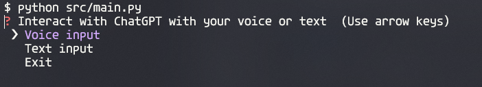

# gtp-assistant
Interact with GPT through a CLI using your microphone to generate voice input.

## Preview


## Setup

Clone the repository and make sure you have `Python 3.x` installed and create a virtual environment:

```shell
python -m venv venv
```

## Install requirements
```shell
pip install -r requirements.txt
```
### Note:
You may encounter some issues installing pyaudio depending on your system. `WSL` distros for example, 
have issues with pyaudio and peripherals like the microphone.

## Config file
Create a `.env` file and store your OpenAI API key
```shell
OPENAI_KEY=<Your API Key>
```

## Run the app
```shell
python src/main.py
```
